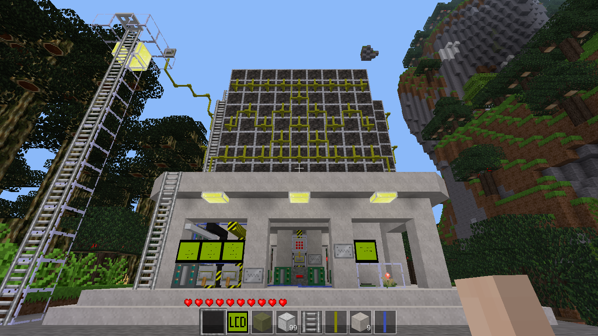
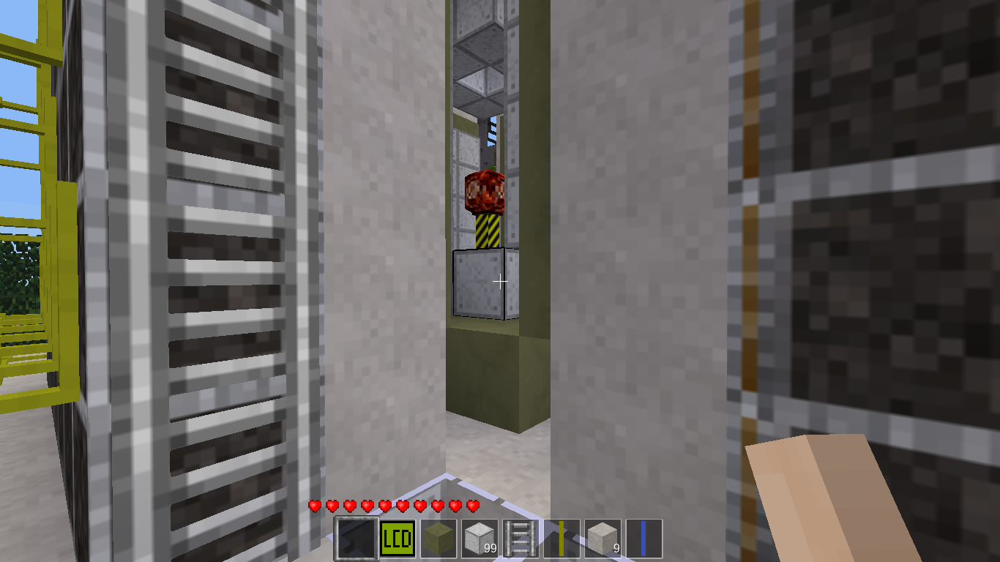
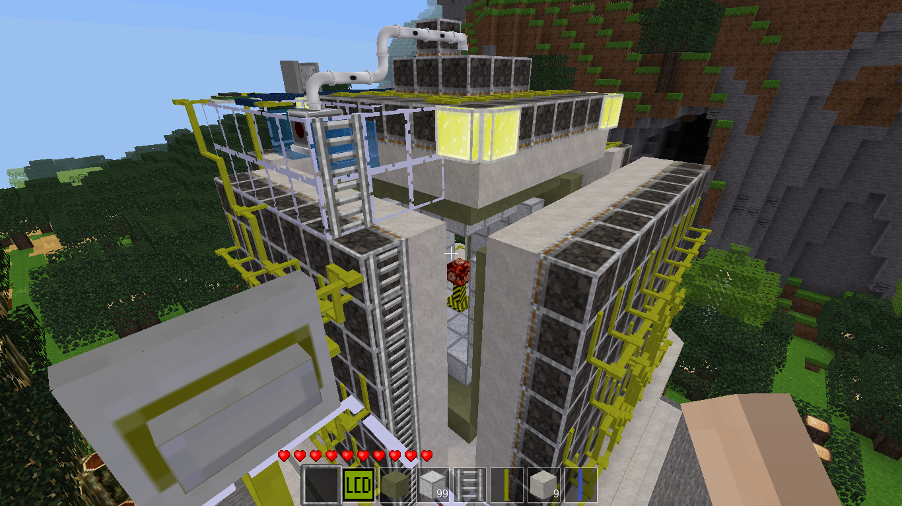
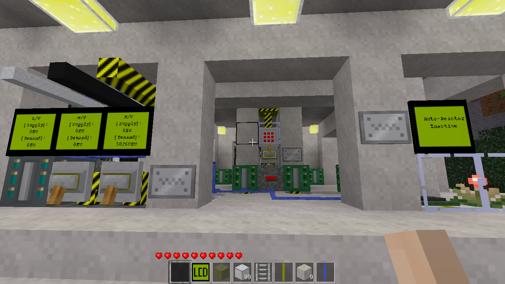

# Auto-Reactor
### Nuclear energy in Minetest at the push of a button.

## Features:
  ### Ships in an open air configuration. Perfect for close inspection or educational showcasing.
  
  ### Seals and activates at the push of a button on the overlooking activation tower.
  
  ### Provides power output at all three voltage levels, monitored by helpful screen readouts.
  
  ### Also:
  
  Glass panelling used to cover supply cables and other components for safety and visibility.
  
  Gravel dumping mechanism in case of meltdown.
  
  
## You will need:
 [ Minetest.](https://minetest.net)
  
  The mods technic, mesecons, digilines, pipeworks and their dependencies; as well as dynamic_liquid for the pump to actually flood the reactor and WorldEdit or some way of loading the schem file.

## How to?
  See Minetest documentation on how to install and enable mods.
  
  Download [this](Auto-Reactor.we) file (Auto-Reactor.we).
  
  See WorldBuilder documentation on how to load the file in your (preferably new) world.

## Notes:
  The reactor alarm klaxon will almost definitely sound during activation. Maybe even twice.
